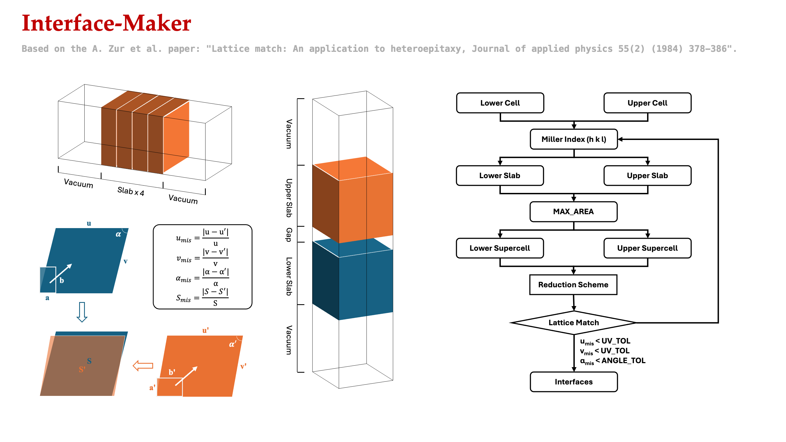

# Interface_Maker
A python3 code to create slabs and interfaces for first-principles calculations. 

This code is based on the A. Zur et al. paper: "Lattice match: An application to heteroepitaxy, Journal of applied physics 55(2) (1984) 378-386".


⭐️ Star the repository if you find it useful :) ⭐️

## Workflow


## Usage
1. Prepare the input POSCAR file and put it in the `input` folder. Note that the conventional cell should be used.
2. Set the parameters in the `interface_maker.py` file:
    ```python
    # Input bulk structures, need the conventional cell
    LOWER_CONV = 'input/POSCAR_LCO_MP_R_3c_Conv.vasp'
    UPPER_CONV = 'input/POSCAR_LNO_MP_I4mmm_Conv.vasp'

    # Maximum Miller indices for h, k, l
    H_MAX, K_MAX, L_MAX = 2, 2, 2

    # Number of lower and upper slabs
    LOWER_SLAB_NUM, UPPER_SLAB_NUM = 1, 1

    # Slab vacuum and interface gap, in Angstrom
    SLAB_VACUUM, INTERFACE_GAP = 6, 3

    # Maximum area of the interface, in A^2
    MAX_AREA = 300

    # Tolerance for the misfit of lattice vectors and angles
    UV_TOL, ANGLE_TOL = 0.01, 1
    ```
3. Run the following command, and the output files will be saved in the `output` folder:
    ```bash
    python3 interface_maker.py
    ```
4. Check the `intf_profiles.txt` file to see the summary of the generated interfaces. Modify the parameters if needed and rerun the code to get the desired interfaces.