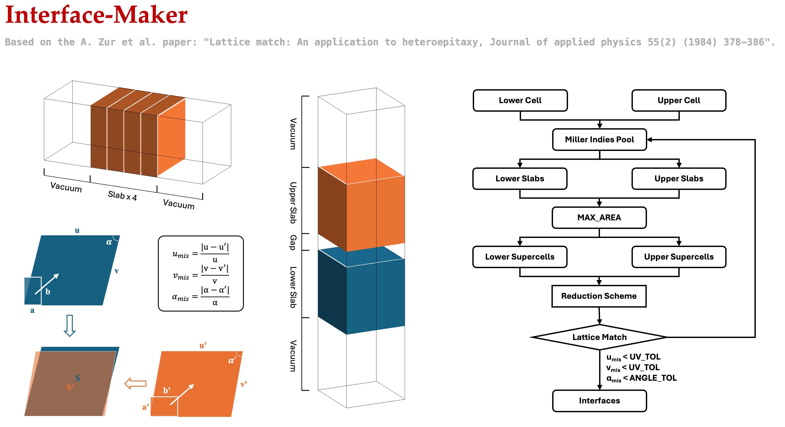

# Interface-Maker
A python3 code to create slabs and interfaces for first-principles calculations. 

This code is based on the A. Zur et al. paper: "Lattice match: An application to heteroepitaxy, Journal of applied physics 55(2) (1984) 378-386". 

By setting the tolerance for the misfit of lattice vectors and angles, the code can automatically find the interfaces with the desired lattice match, also ensuring the matching area / supercell size to be small enough. The code can also generate the slabs with the desired thickness and vacuum, and the interfaces with the desired gap.

⭐️ Star the repository if you find it useful :) ⭐️

## Workflow


## Usage
1. Prepare the input POSCAR file and put it in the `input` folder. Note that the conventional cell should be used.
2. Set the parameters in the `interface_maker.py` file:
    ```python
    # Input bulk structures, need the conventional cell
    LOWER_CONV = 'input/POSCAR_LCO_MP_R_3c_Conv.vasp'
    UPPER_CONV = 'input/POSCAR_LNO_MP_I4mmm_Conv.vasp'

    # Option 1: Set maximum Miller indices of h, k, l for lower and upper slabs
    MAX_H, MAX_K, MAX_L = 1, 1, 1

    # # Option 2: Assign the specific Miller indices for lower and upper slabs
    # LOWER_HKL, UPPER_HKL = (1, 0, 0), (1, 0, 0)

    # Minimum thickness of the slab, without vacuum, in Angstrom
    MIN_SLAB_THICKNESS = 10

    # Slab vacuum and interface gap, in Angstrom
    SLAB_VACUUM, INTERFACE_GAP = 10, 2

    # Maximum area of the interface, in A^2
    MAX_AREA = 2000

    # Tolerance for the misfit of lattice vectors and angles
    UV_TOL, ANGLE_TOL = 0.02, 1
    ```
3. Run the following command, and the output files will be saved in the `output` folder:
    ```bash
    python3 interface_maker.py
    ```
4. Check the `intf_profiles.txt` or `intf_profiles.csv` file to see the summary of the generated interfaces. Modify the parameters if needed and rerun the code to get the desired interfaces. A example of the `intf_profiles.txt` file is shown below:
    ```
    ++++++++++++++++++++++++++++++++++++++++++++++++++++++++++++

                        Interface Maker v1.0                    
                By Guangchen Liu, gliu4@wpi.edu               

    ++++++++++++++++++++++++++++++++++++++++++++++++++++++++++++

                    Miller indices considered: 7                

                (0, 0, 1) (0, 1, 0) (0, 1, 1)                
                (1, 0, 0) (1, 0, 1) (1, 1, 0)                
                            (1, 1, 1)                          

    Search results for matched interfaces with area within 2000 A^2: 

    Lower hkl           Upper hkl           Area (A^2)          Found Number        
    (0, 0, 1)           (0, 0, 1)           266                 1                   
    (0, 0, 1)           (0, 1, 0)           936                 2                   
    (0, 0, 1)           (0, 1, 1)           476                 1                   
    (0, 0, 1)           (1, 0, 0)           936                 2                   
    (0, 0, 1)           (1, 0, 1)           476                 1                   
    (0, 0, 1)           (1, 1, 0)           216                 1                   
    (0, 0, 1)           (1, 1, 1)           356                 2                   
    (0, 1, 0)           (0, 0, 1)           576                 1                   
    (0, 1, 0)           (0, 1, 0)           1926                5                   
    (0, 1, 0)           (0, 1, 1)           786                 1                   
    (0, 1, 0)           (1, 0, 0)           1926                5                   
    (0, 1, 0)           (1, 0, 1)           786                 1                   
    (0, 1, 0)           (1, 1, 0)           -                   0                   
    (0, 1, 0)           (1, 1, 1)           286                 1                   
    (0, 1, 1)           (0, 0, 1)           956                 4                   
    (0, 1, 1)           (0, 1, 0)           1236                2                   
    (0, 1, 1)           (0, 1, 1)           1156                1                   
    (0, 1, 1)           (1, 0, 0)           1236                2                   
    (0, 1, 1)           (1, 0, 1)           1156                1                   
    (0, 1, 1)           (1, 1, 0)           -                   0                   
    (0, 1, 1)           (1, 1, 1)           506                 2                   
    (1, 0, 0)           (0, 0, 1)           546                 2                   
    (1, 0, 0)           (0, 1, 0)           796                 2                   
    (1, 0, 0)           (0, 1, 1)           876                 4                   
    (1, 0, 0)           (1, 0, 0)           796                 2                   
    (1, 0, 0)           (1, 0, 1)           876                 4                   
    (1, 0, 0)           (1, 1, 0)           216                 1                   
    (1, 0, 0)           (1, 1, 1)           296                 2                   
    (1, 0, 1)           (0, 0, 1)           156                 1                   
    (1, 0, 1)           (0, 1, 0)           1186                4                   
    (1, 0, 1)           (0, 1, 1)           1256                3                   
    (1, 0, 1)           (1, 0, 0)           1186                4                   
    (1, 0, 1)           (1, 0, 1)           1256                3                   
    (1, 0, 1)           (1, 1, 0)           216                 1                   
    (1, 0, 1)           (1, 1, 1)           506                 1                   
    (1, 1, 0)           (0, 0, 1)           526                 1                   
    (1, 1, 0)           (0, 1, 0)           -                   0                   
    (1, 1, 0)           (0, 1, 1)           1346                1                   
    (1, 1, 0)           (1, 0, 0)           -                   0                   
    (1, 1, 0)           (1, 0, 1)           1346                1                   
    (1, 1, 0)           (1, 1, 0)           1816                6                   
    (1, 1, 0)           (1, 1, 1)           1576                3                   
    (1, 1, 1)           (0, 0, 1)           -                   0                   
    (1, 1, 1)           (0, 1, 0)           1036                2                   
    (1, 1, 1)           (0, 1, 1)           1756                3                   
    (1, 1, 1)           (1, 0, 0)           1036                2                   
    (1, 1, 1)           (1, 0, 1)           1756                3                   
    (1, 1, 1)           (1, 1, 0)           656                 1                   
    (1, 1, 1)           (1, 1, 1)           586                 1                   
            
    Total number of interfaces found: 94            

    ----------------------- Interface 1 ------------------------
    Total atoms:                            598
    Lower / Upper hkl:                      (001) / (001)
    Lower / Upper area (A^2):               262.54 / 261.77

    U misfit (%):                           0.596748
    V misfit (%):                           0.882101
    Angle misfit (°):                       0.210358
    Area misfit (%):                        0.289945

    Transformed matrix for lower slab:
    3.000000  0.000000
    0.000000  3.000000

    Transformed matrix for upper slab:
    1.000000  4.000000
    -4.000000  1.000000


    ----------------------- Interface 2 ------------------------
    Total atoms:                            2344
    Lower / Upper hkl:                      (001) / (010)
    Lower / Upper area (A^2):               933.46 / 933.49

    U misfit (%):                           1.018769
    V misfit (%):                           1.196245
    Angle misfit (°):                       0.389795
    Area misfit (%):                        0.003309

    Transformed matrix for lower slab:
    -4.000000  4.000000
    -5.000000  -3.000000

    Transformed matrix for upper slab:
    1.000000  7.000000
    -2.000000  5.000000


    ----------------------- Interface 3 ------------------------
    ...
    
    ```